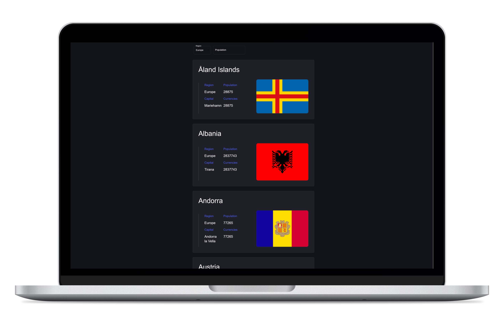
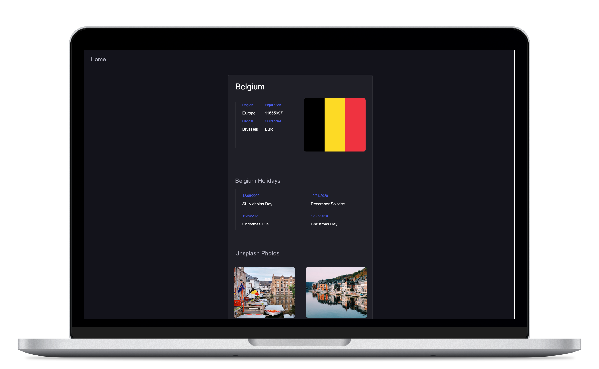
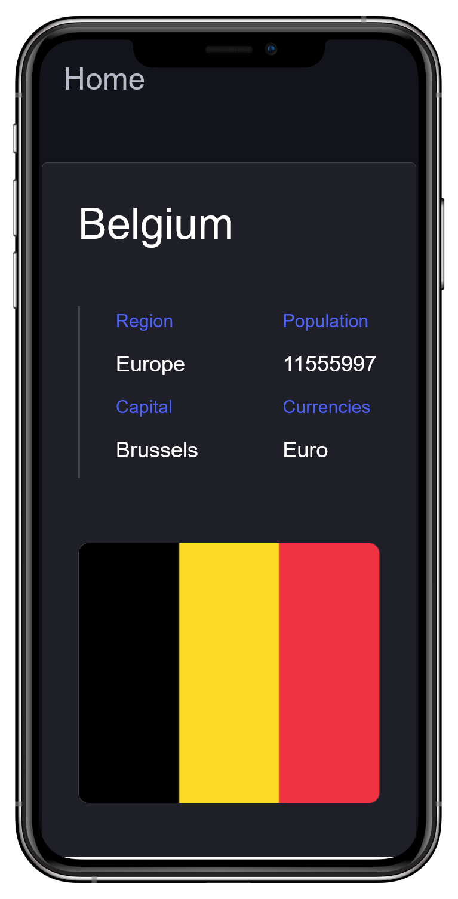
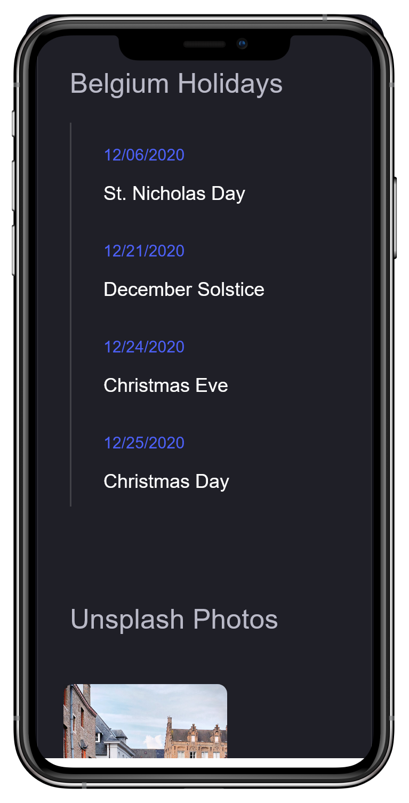
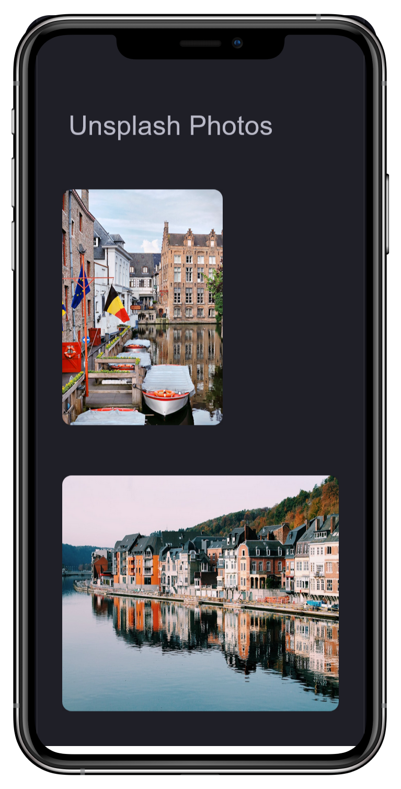

# React Countries

<h2>Description</h2>
- This app connects to <a className='outsidelink' href='https://restcountries.com/'>Rest Countries</a> Api
- It then displays all countries and information about each
- When a country is viewed individually, a connection is made to <a className='outsidelink' href='https://www.abstractapi.com/'>Abstract's Holiday Api </a>and <a className='outsidelink' href='https://unsplash.com/developers'>Unsplash's Photo Api</a>

- Holidays and photos for the specific country are then displayed

<h2><a href="https://countries.stephengordon.ie/">Try it out</h2>

## Screenshots

  
  

  
  
  

  

## Technologies / Frameworks
- React
- Material UI 
- Axios 

## Connect With Me
- LinkedIn: [Stephen Gordon](https://www.linkedin.com/in/ste-gordon/)
- [Portfolio](https://www.stephengordon.ie)

## How To Use

To get started with React Countries, follow these steps:

<ol>
	<li>Clone the repository to your local machine.</li>
	<li>Install the necessary dependencies using <code>npm install</code>.</li>
	<li>Start the application using <code>npm start</code>.</li>
</ol>
